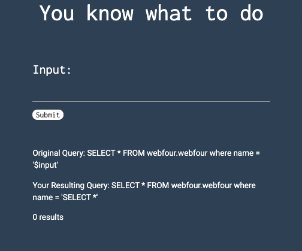

# [Basic Injection](https://ctflearn.com/challenge/88) (30)
By visiting the first [link](https://web.ctflearn.com/web4/), you will be greeted by an input prompt:  
 
  
The text above states *You know what to do*, and you should if you completed the [lab](https://ctflearn.com/lab/sql-injection-part-1).  
We can see that the SQL database is called `webfour.webfour`, we need to build a query that returns all data in the table.  
We can use SQL injection for this, once we hit "Submit", the text we enter will be used in the db query.  
Input: `thomas' or '1' = '1` will return all database entries.  
In the table, we can see our flag: `CTFlearn{th4t_is_why_you_n33d_to_sanitiz3_inputs}`  
