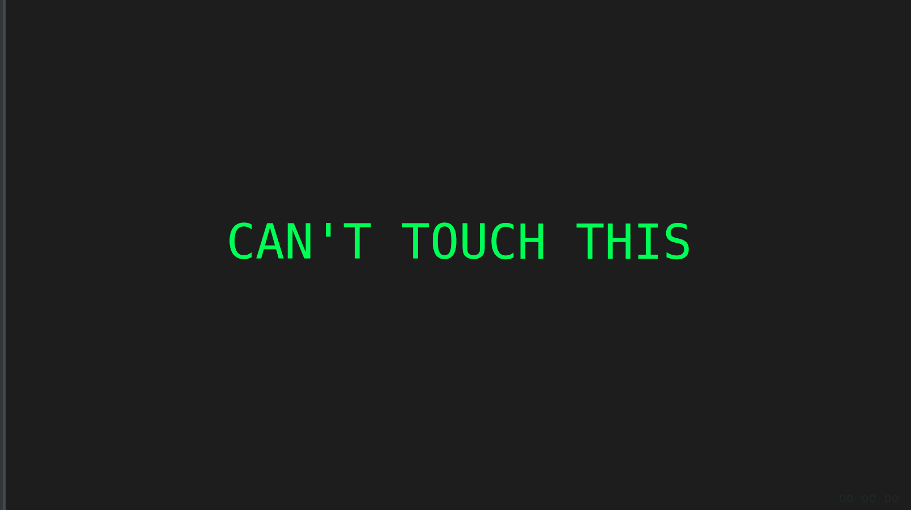

# [PDF by fdpumyp](https://ctflearn.com/challenge/957) (20)
We are given a [pdf file](https://ctflearn.com/challenge/download/957). When opened it we see the following: <br />
 <br />
Running `strings dontopen.pdf` we see a few interesting finds: <br />
```
<</Type/Catalog/Pages 7 0 R/Names<</EmbeddedFiles<</Names[(.secret)<</CI<<>>/EF<</F 13 0 R>>/F(.\\.backup)/UF(.\\.backup)/Desc(.\\.backup)/Type/Filespec>>]>>>>/PageMode/UseAttachments>>

(...)

== SECRET DATA DONT LOOK AT THIS ==
external:Q1RGbGVhcm57KV8xbDB3M3kwVW0wMG15MTIzfQ==
pin:1234
password:MTIzMVdST05HOWlzamRuUEFTU1dPUkQ=
```
Seems there may be an embedded file in the pdf, using `foremost` we find no results though. <br />

Decoding the base64, we get two results: <br />
external: `CTFlearn{)_1l0w3y0Um00my123}` <br />
password: `1231WRONG9isjdnPASSWORD` <br />

Our flag is `CTFlearn{)_1l0w3y0Um00my123}` <br />
