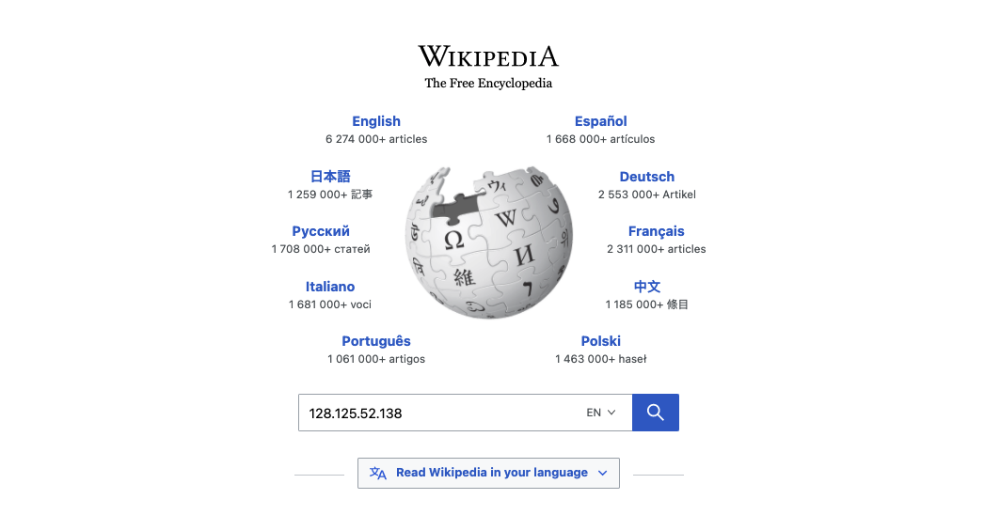
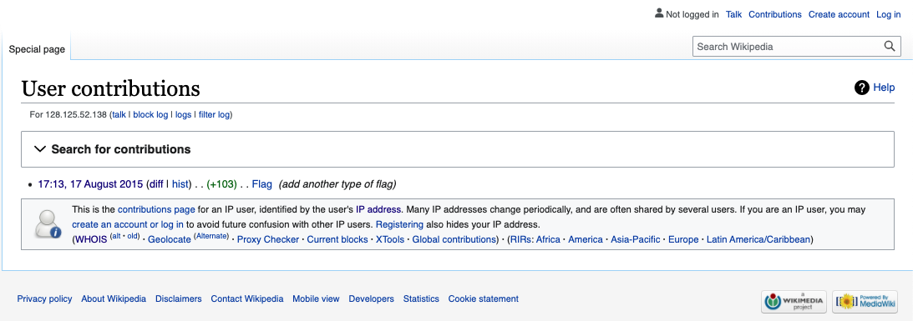

# [Wikipedia](https://ctflearn.com/challenge/168) (30)
A strange problem, tried pinging the ip, visiting it in the browser, googling it etc.  
The solution is to go the wikipedia and simply search for the ip.  
 

This will search for all user contributions from the IP 128.125.52.138, the one from 17 August 2015 is relevant. 
 

Viewing the [diff](https://https://en.wikipedia.org/w/index.php?title=Flag&diff=prev&oldid=676540540) of the contribution we find the flag.  
`cNi76bV2IVERlh97hP`
